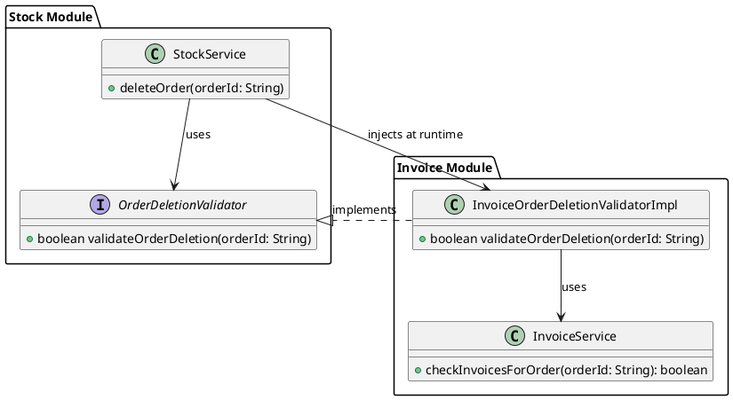

Recently, I came across an interesting challenge in one of my projects. 
I was working on a multi-module backend application that had two main modules: the `stock-module` and the `invoice-module`

In the `stock-module`, we manage order entities and all the business logic related to orders. 
In the `invoice-module`, we handle invoice entities, and each invoice is linked to specific orders, 
meaning that the `invoice-module` depends on the `stock-module`.

Then, a new feature request came in: when deleting an order, we need to check whether there are any invoices linked to it. 
If there are, the order should not be deleted.

This raised a challenge. The `stock-module` didn’t have direct access to the invoice data, 
and if I tried to link them by making the `stock-module` dependent on the `invoice-module`, 
we would create a circular dependency, which is a common problem in multi-module applications. 
Despite this, the feature had to be delivered.

To solve this, I used the principle of Inversion of Control (IoC). 
In the `stock-module`, I introduced an interface called OrderDeletionValidator. 
This interface was then implemented in the `invoice-module`. 
With this approach, the `stock-module` only needs to know about the interface, not the actual implementation.

At runtime, the implementation from the `invoice-module` is injected into the `stock-module`. 
This allowed me to perform the invoice check during the order deletion process without creating a circular dependency.

Problem solved!

